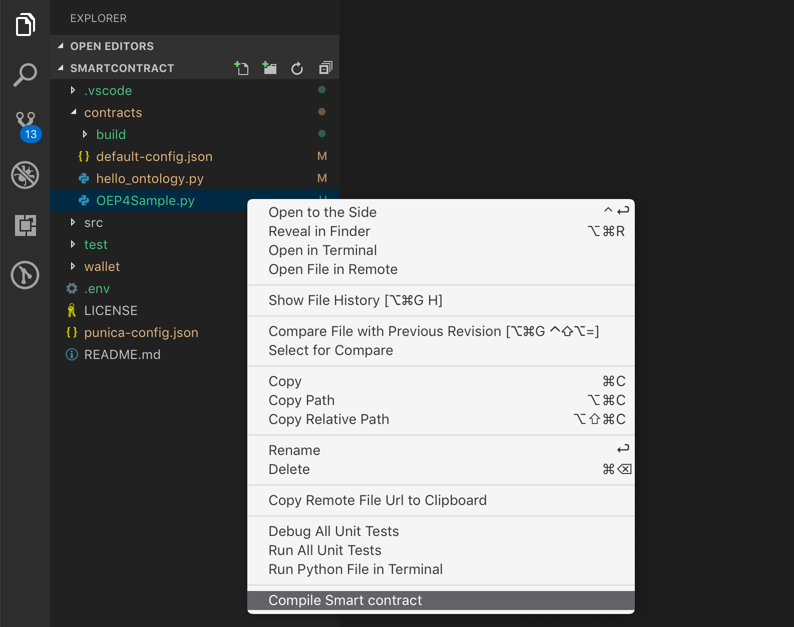
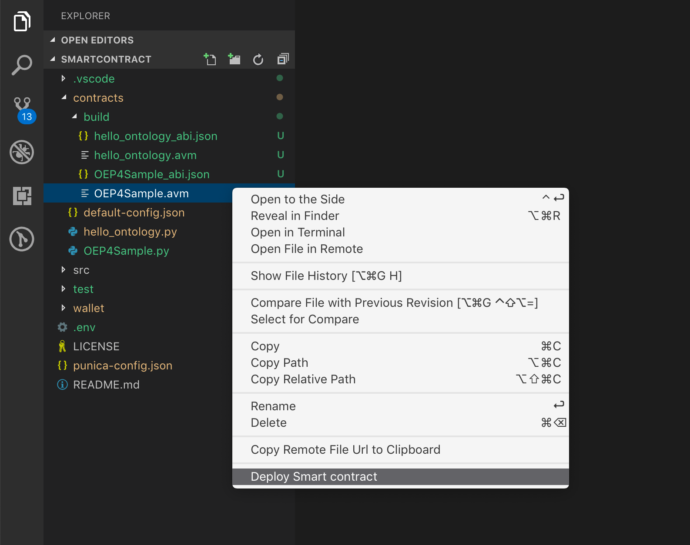
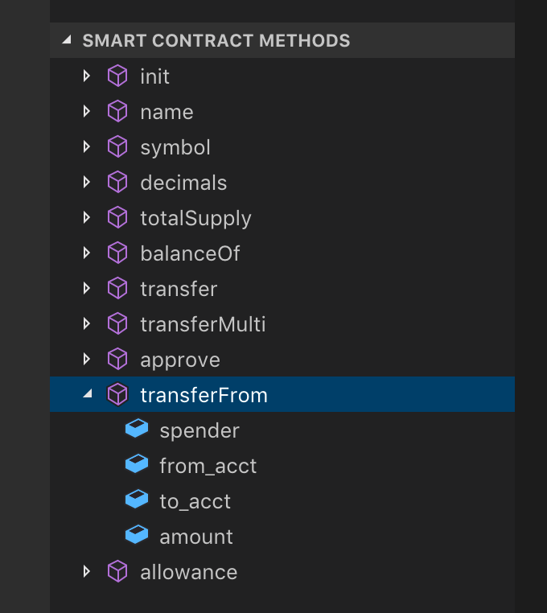
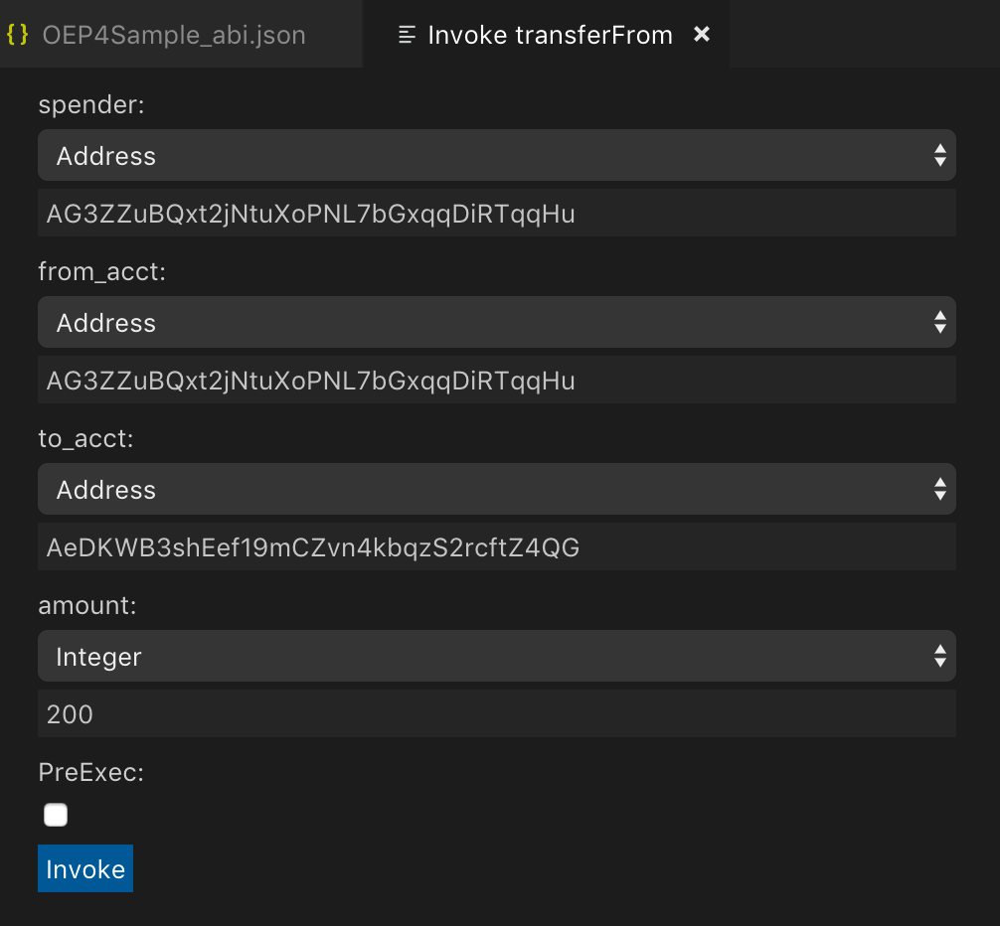
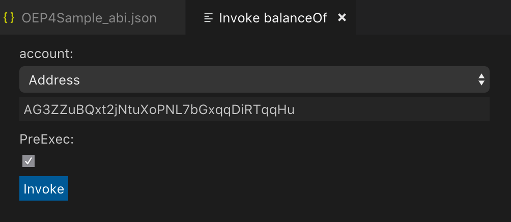

# VSCode Extension for Ontology

This extension add support for development and testing of Smart contracts on Ontology blockchain.

## Features

### Compile

- Python smart contracts (.py)
- CSharp smart contracts (.cs)

### Deploy

- Deployment to TestNet / MainNet / PrivateNet

### Invoke

- Payed and PreExec transactions

### Debug

- Debug advancing (StepIn, StepOut, Next, Continue, Stop, Restart)
- Breakpoints
- Variables preview and set
- State store manipulation

## Extension Settings

This extension contributes the following settings:

- `ontology.network.type`: specifies which network will be used during deploy and invoke
- `ontology.network.private`: PrivateNet address RPC address in the form http://host:port
- `ontology.wallet`: wallet file used during deploy and invoke (you can use \${workspaceFolder} in the path)
- `ontology.payer`: default payer address (must be found in wallet file)
- `ontology.deploy.gasLimit`: gas limit used during deploy
- `ontology.deploy.gasPrice`: gas price used during deploy
- `ontology.invoke.gasLimit`: gas limit used during invoke
- `ontology.invoke.gasPrice`: gas price used during invoke

## Release Notes

See [CHANGELOG.md](CHANGELOG.md)

### How to use this extension?

Press Ctrl+Shift+X or Cmd+Shift+X to open the Extensions pane. Find and install the VSCode Extension for Ontology extension. You can also install the extension from the Marketplace. Open any .py or .cs file in VS Code. The extension is now activated.

This extension enhances the whole Smart contract development process.

#### Compile

To compile a smart contract, show context menu on any .py or .cs file.

Press `Compile smart contract`. You will be notified about the outcome of compilation through notifications. The compilation will produce compiled code in .avm file and smart contract description file in \_abi.json file, both in `build` folder.

#### Deploy

To deploy a smart contract, show context menu on compiled .avm file.

Press `Deploy smart contract`. A new panel with description form will show up. Enter the necessary information and press `Deploy`.

You will be notified about the outcome of compilation through notifications.

#### Invoke & Debug

To invoke a method of smart contract open the \_abi.json file. A new panel with smart contract methods will show up.

Double click on any of the methods to show invoke form. Fill out all the parameters and choose if you want to preExec the transaction or you want to make paid transaction.

You will be notified about the progress of invocation through notifications and a new panel with invocation result will show up.

If you want to instead debug the smart contract invocation in embedded virtual machine, press Debug. You can use standard debug features of VSCode as StepIn, StepOut, Next, Continue, Restart, Stop and breakpoints together with variables preview and set.

## Authors

- **Matus Zamborsky** - _Initial work_ - [Backslash47](https://github.com/backslash47)

## License

This project is licensed under the LGPL License - see the [LICENSE.md](LICENSE.md) file for details.
